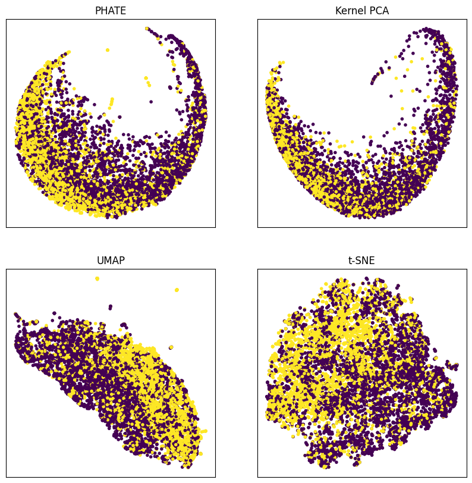
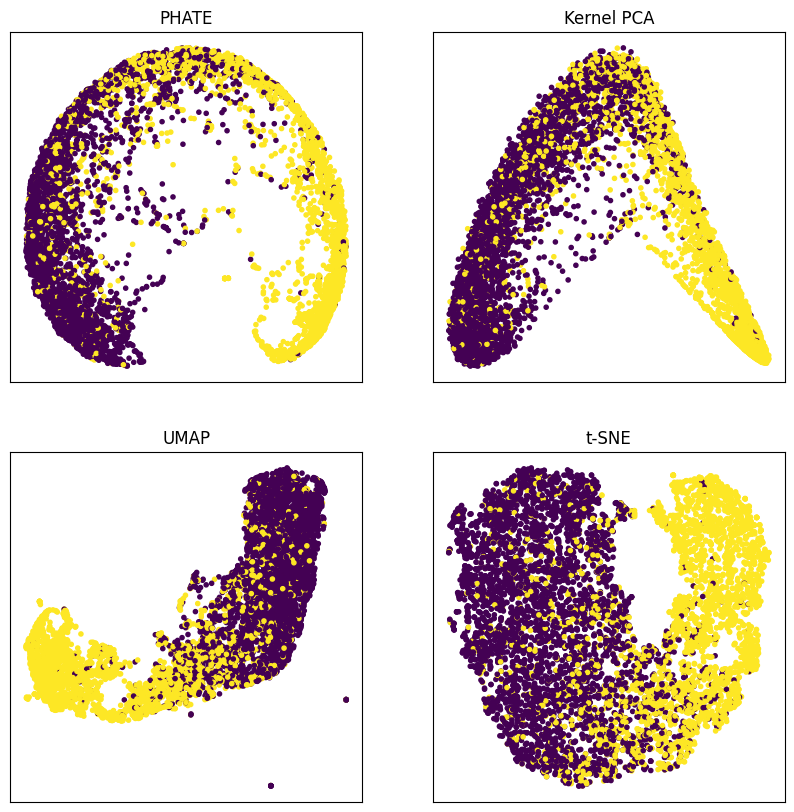
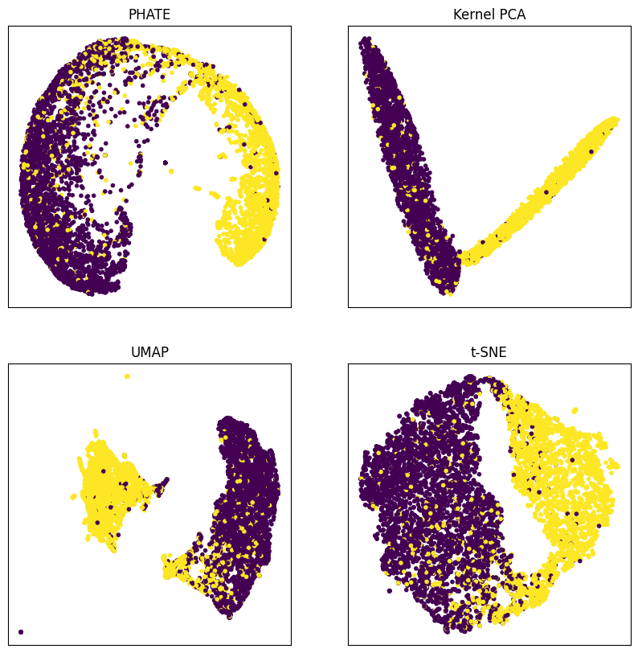

# Machine Learning Final Project / Classifying Disaster Tweets Using BERT

## The Goal

In today’s information age, the widespread use of social
media platforms is a promising method for early response
to local disaster management. The dynamic nature of social
media presents an opportunity to leverage the collective
data generated by users to identify and validate potentially
hazardous events in real time. This information can form
a foundation for informed decision-making, contributing
to a timely and appropriate allocation of resources to an
observed disaster.
The vast amount of data presented to users, by users,
presents both a benefit and a limitation when developing
appropriate responses to situations. The ability to find
authentic reports of natural disasters in social media con-
tent is pivotal for effective disaster management, both to
respond quickly to active events and to protect against the
misallocation of resources to a false event. Consequently,
developing reliable methods to filter social media data to
identify true natural disasters is paramount.
In the pursuit of increasing the reliability of early disaster
response through social media, this project investigates and
evaluates different methodologies for classification. The
project relies on textual mapping to a vector representation
to enable the use of known machine-learning methods to
find social media posts reporting natural disasters.
The dataset for this project is from Kaggle [2] and
serves as a very straightforward Natural Language Pro-
cessing (NLP) task for those learning NLP. This dataset
is well explored and high-performing models are usually
based on modern Transformer Neural Network architectures
such as BERT (Bidirectional Encoder Representations from
Transformers) for interpreting natural language as in [4].
As a result, the team proposes using BERT to transform
the tweets into features for each of the machine-learning
methods.

## The Data

The dataset for this project is from the Kaggle competi-
tion, ”Natural Language Processing with Disaster Tweets”
[2] which is a supervised classification task. This dataset
consists of 7,614 data points with 3 features, namely:
keyword, location, and the actual text of the tweet. For this
project, the team will only be using the text of the tweet to
classify each tweet as belonging to a natural disaster report.
For preprocessing, the team uses a predefined tokenizer
to split the tweets into embeddings interpretable by BERT.
Each tweet is then padded to 512 tokens to produce a text
dataset with a constant feature length. This representation
is more conducive to parallel evaluation on modern GPUs.
The dataset is then split into 80% training, 20% validation,
and an additional testing dataset without labels is provided
by Kaggle. To measure performance the team uses 5 fold
cross-validation accuracy to rank each of the methods. This
is a result of not having labels for the testing dataset and
not being able to submit answers to Kaggle multiple times.
In addition, the F1 score of the best-performing machine-
learning method is computed for comparison to the Kaggle
leaderboard.

## The Methods

### Prompt to Features
Recognizing the complex nature of textual input to a
machine learning method, this project leverages the modern
transformer Neural Network BERT to map textual informa-
tion to a reduced-dimensional vector representation. This
process is done using a pre-trained uncased version of
BERT and using the final pooled output from each text input
as input features for each of the machine learning methods.
By using a pre-trained version, the BERT model already
has a fairly intricate understanding of natural language
and relationships between words in the form of a latent
representation.
To further improve prediction, the team fine-tunes the
parameters of BERT in multiple stages to see how the
output features improve. This fine-tuning is typically re-
ferred to as Transfer Learning, where the understanding
of one model is used in a similar problem. In the case
of this project, the language understanding of BERT is
transferred to classifying language as a disaster report or
not. The transfer learning is done by adding another layer
after BERT’s pooling layer and training BERT to classify a
training set of tweets. In doing this, the researchers can fine-
tune some of BERT’s parameters to specialize to the task.
The researchers determine the effectiveness of the transfer
learning by isolating the fine-tuning to the pooling layer,
one attention head, three attention heads, four attention
heads, and four attention heads with the pooling layer.

### Visualization
This project utilizes Uniform Manifold Approximation
and Projection (UMAP) as in [3], Kernel Principle Compo-
nents Analysis (KPCA), T-distributed Stochastic Neighbor
Embedding (T-SNE), and Potential of Heat-diffusion for
Affinity-based Transition Embedding (PHATE) to visualize
the vectorized output from the BERT model. The goal
of the visualization is to determine if natural clusters or
clear separation is present in the vectorized version of the
prompts. Determining a relationship between the prompts
and inputs allows for more targeted exploration of the input
prompts. The data visualization also gives a rough estimate
of how effective each machine-learning method will be on
the BERT features. In addition, the team also visualizes the
transfer learning process by showing the BERT features
at varying degrees of fine-tuning. This also shows which
elements of BERT are more important for classifying the
disaster tweets.

### Algorithms
In many ways, this project can be viewed from the
transfer learning perspective, where the goal is to learn a
mapping of the output of BERT that classifies the prompts
correctly. To accomplish the classification, the project uses
Logistic Regression, Support Vector Classification (SVC),
Random Forest Classification, and a Neural Network. Hy-
perparameter tuning for each of the machine learning meth-
ods is done by performing a grid search over the relevant
parameters for each method. Each of the methods then
trains on the BERT features and is evaluated based on their
accuracy. This helps the team understand the effect of fine-
tuning different elements of BERT as well as which method
performs the best.
This project utilizes Sci-Kit Learn’s implementation of
Logistic Regression, SVC, and Random Forest Classifica-
tion. This project also utilizes PyTorch for implementing
Neural Networks and accessing a pre-trained version of
BERT.

## The Results

### Visualization

The team begins by visualizing the vectorized output of
the original pre-trained BERT model.

Fig. 1: Visualization of original BERT pooled output on
tweet dataset.

Fig. 1 shows the output from the original pre-trained
BERT model allows for some separation of the data in two
dimensions. However, there is still a significant amount of
mixing where the decision boundary in two dimensions is
unclear.

Fig. 2: Visualization of BERT pooled output after tuning
pooling layer on tweet dataset.

Fig. 2 shows fine-tuning the pooling layer of BERT
allows for more separation of the data in two dimensions.
A significantly greater clustering of the actual disaster-
related tweets can be seen compared to Fig. 1. This shows
classification on the pooling layer tuned version of BERT
likely will increase the performance of the machine learning
methods. However, the tuning is likely not as effective as
putting more weight on words or combinations of words
that have a high likelihood of being disaster-related.

Fig. 3: Visualization of BERT pooled output after tuning
one attention head on tweet dataset.

Fig. 3 reinforces the previous conclusion that specific
words or combinations of words have a high likelihood
of being disaster-related. This is due to the increase in
separability in the two-dimensional output from each of the
methods. Fig. 3 also shows there are still some tweets that
are difficult to classify and all methods show there is a clear
overlap point in the tweets.
Fig. 4: Visualization of BERT pooled output after tuning
four attention heads on tweet dataset.
Fig. 4 shows that after fine-tuning four of BERT’s atten-
tion heads, the data is more separable in two dimensions
compared to results shown in Fig. 1. This further solidifies
the conclusion that much of BERT’s understanding of
sentence structure is in the attention heads. In addition, the
separability of the data also shows the highest accuracy
of each machine-learning method will likely occur when
the maximum attention heads are fine-tuned. The UMAP
visualization of the data in Fig. 4 also shows there are 2
distinct groups in the data. In the PHATE visualization, one
can see the same extremely sparse connection between the
two classes.
